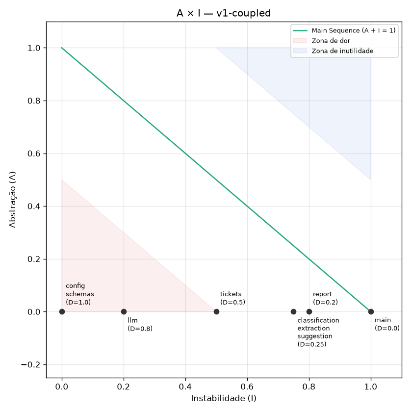
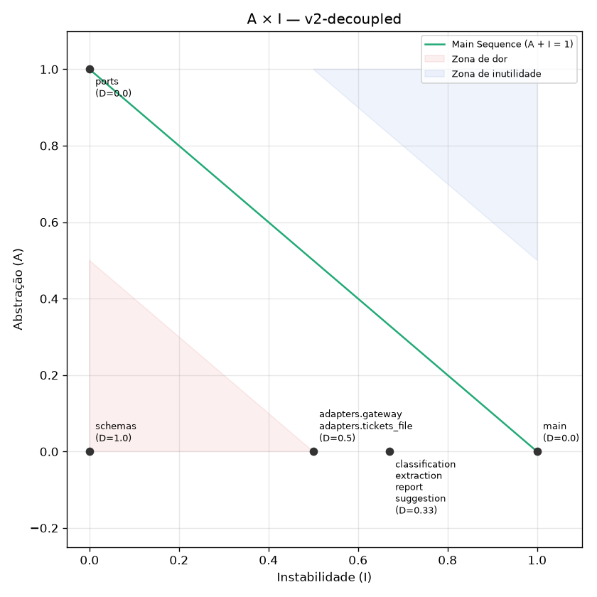
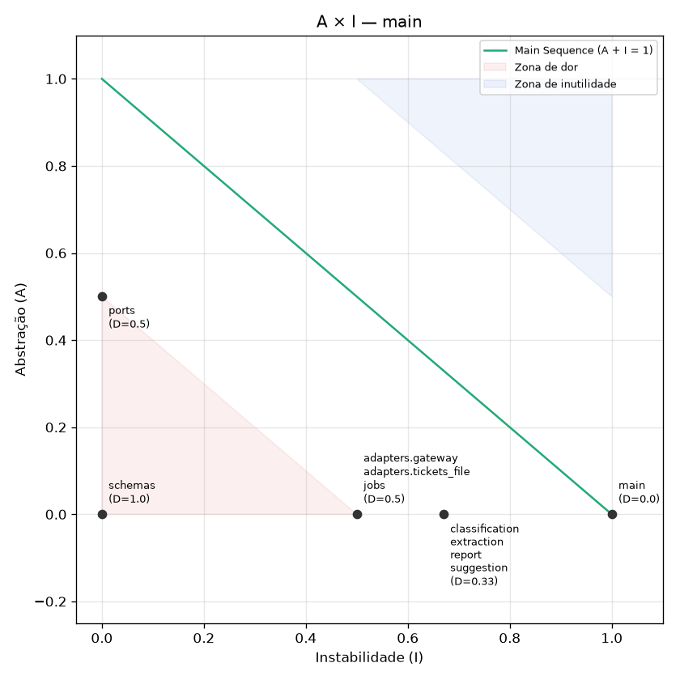

# Helpdesk com IA: da integração frágil à arquitetura resiliente

Solução do desafio [desafio-arquitetura-era-ia-1](https://github.com/devfullcycle/desafio-arquitetura-era-ia-1) (o enunciado continua no repositório base).

Marcos no git:

- tag `v1-coupled`: a aplicação como foi recebida, mais a suíte de caracterização;
- tag `v2-decoupled`: a aplicação refatorada, já atrás do gateway, com o mesmo comportamento;
- branch `main`: a versão final, com o modo de execução de cada feature decidido.

## Visão geral

A aplicação FastAPI deixou de conhecer providers, modelos e chaves. Ela pede **capacidades lógicas** (`ticket-classifier`, `reply-writer`, `topic-analyzer`, `order-extractor`) a um **AI Gateway** self-hosted (LiteLLM, serviço `gateway`), usando uma chave virtual própria. O gateway guarda as chaves dos providers, decide o modelo físico de cada capacidade, aplica orçamento e limite de requisições por chave, e cuida de timeout, retry com backoff e fallback. Dentro da aplicação, só `app/helpdesk/adapters/gateway.py` fala com o gateway; as features recebem a porta `LanguageModel` (`app/helpdesk/ports.py`) por injeção, a partir do ponto de composição `app/helpdesk/main.py`. Cada feature tem o modo de execução que o seu contrato pede: F1 e F4 síncronas, F2 em streaming (SSE) e F3 assíncrona (202 + status + 303).

**Quando um provider cai**, o gateway tenta o primário até 3 vezes em `5xx`/`429` (uma vez só em timeout) e passa para o modelo `large` equivalente do outro provider, que dá a mesma saída. Nenhuma feature para. **Quando os dois `large` caem**, F1, F2 e F3 respondem com um modelo `mini`, porque a evidência mostrou que ali uma resposta pior é aceitável (ou nem é pior). A F4, que alimenta uma automação sem revisão humana, falha com `503`, porque o `mini` troca o número do pedido pelo da nota fiscal em 15% dos casos. Se a geração da F2 quebra no meio, o atendente recebe um evento `error` dentro do stream. Se o relatório não consegue terminar, a tarefa chega a `failed` com motivo em menos de 60 s. Nenhum caso termina em `504` da borda.

## Diagnóstico da v1

As quatro dores reproduzidas na aplicação recebida (`v1-coupled`), pela borda (`localhost:8000`), com o provider simulado. Os trechos citados são de `app/helpdesk/` na tag `v1-coupled`.

### Dor 1: o relatório do mês não chega

```bash
curl -s -o /dev/null -w "status=%{http_code} tempo=%{time_total}s\n" -X POST localhost:8000/reports/topics \
  -H "Content-Type: application/json" -d '{"start": "2026-08-01", "end": "2026-08-31"}'
# e, nos minutos seguintes:
curl -s "localhost:8090/admin/calls?last=5000"
```

- **Observado:** `status=504 tempo=30.009s`, a página de erro do nginx. Só 3 chamadas tinham terminado quando a borda desistiu. A aplicação **continuou trabalhando**: `/admin/calls` foi de 11 chamadas (1 min depois) a 34 chamadas `anthropic claude-fake-large topics 200`, a última 5 min 23 s depois do pedido. No total, 222.114 tokens de entrada e 12.162 de saída, **~US$ 0,85 por um resultado que ninguém recebeu**. Cada lote leva ~9,8 s.
- **Causa:** `report.py:15-18` processa 34 lotes de 150 tickets um depois do outro, dentro de uma rota síncrona (`main.py:30-32`), que só manda o primeiro byte no fim. A borda (`edge/nginx.conf`, `proxy_read_timeout 30s`) corta depois de 30 s sem bytes, e nada cancela o trabalho do lado da aplicação: desistir não é cancelar.

### Dor 2: a sugestão deixa o atendente esperando sem ver nada

```bash
curl -sN -o /dev/null -w "status=%{http_code} primeiro_byte=%{time_starttransfer}s total=%{time_total}s\n" \
  -X POST localhost:8000/tickets/reply-suggestion -H "Content-Type: application/json" \
  -d '{"ticket_id": "TK-00042", "text": "Meu pedido #481516 não chegou e já passou do prazo, urgente"}'
```

- **Observado:** `status=200 primeiro_byte=16.18s total=16.18s`. O primeiro byte chega junto com o último. `/admin/calls`: `anthropic claude-fake-large suggest stream=false 200`, 608 tokens de saída, `duration_ms=16006`.
- **Causa:** `llm.py:20-26` chama `messages.create` sem `stream`, e `suggestion.py:6-7` e a rota `main.py:20-22` devolvem a sugestão inteira num JSON. Com ~0,8 s até o primeiro token e 40 tokens/s, ~600 tokens são ~16 s de tela parada.

### Dor 3: com um provider fora do ar ou travado, parte do helpdesk para

```bash
curl -s -X POST localhost:8090/admin/failures -H "Content-Type: application/json" -d '{"provider": "anthropic", "mode": "error_500"}'
curl -s -w "\nstatus=%{http_code} tempo=%{time_total}s\n" -X POST localhost:8000/tickets/reply-suggestion \
  -H "Content-Type: application/json" -d '{"ticket_id": "TK-00042", "text": "Meu pedido não chegou"}'
curl -s -o /dev/null -w "F1 status=%{http_code}\n" -X POST localhost:8000/tickets/classification \
  -H "Content-Type: application/json" -d '{"ticket_id": "TK-00042", "text": "Meu pedido não chegou"}'
curl -s -X POST localhost:8090/admin/failures -H "Content-Type: application/json" -d '{"provider": "anthropic", "mode": "timeout"}'
curl -s -o /dev/null -w "status=%{http_code} tempo=%{time_total}s\n" -X POST localhost:8000/tickets/reply-suggestion \
  -H "Content-Type: application/json" -d '{"ticket_id": "TK-00042", "text": "Meu pedido não chegou"}'
curl -s -X POST localhost:8090/admin/reset
```

- **Observado com `error_500`:** F2 responde `Internal Server Error`, `status=500` em 1,34 s. `/admin/calls` mostra **3** chamadas `anthropic claude-fake-large suggest 500` (16:56:43.053, 16:56:43.490, 16:56:44.320), que são os 2 retries padrão do SDK. Ao mesmo tempo, a F1 responde `200` em 1,21 s pela OpenAI: metade do helpdesk parada.
- **Observado com `timeout`:** F2 termina em `504` da borda aos 30,05 s. A chamada ao provider fica pendurada (`duration_ms: null`); o provider segura a conexão por 300 s.
- **Causa:** `llm.py:8-9` cria os clientes sem timeout nem `max_retries`, então valem os padrões dos SDKs. Conferido no container: `openai 3.19.0` e `anthropic 1.8.0` usam `Timeout(connect=5, read=600)` e `max_retries=2`, ou seja, até ~30 min numa chamada travada, contra os 30 s da borda. Além disso, `config.py:10-13` amarra cada feature a um provider, sem nenhum fallback.

### Dor 4: trocar o modelo de uma feature exige mudar código e reconstruir

```bash
# alteração temporária, desfeita antes da tag v1-coupled:
sed -i 's/^CLASSIFICATION_MODEL = "gpt-fake-large"/CLASSIFICATION_MODEL = "gpt-fake-mini"/' app/helpdesk/config.py
docker compose restart app                            # não basta
docker compose up -d --build --no-deps --wait app     # rebuild e recriação do container
git checkout app/helpdesk/config.py
```

- **Observado:** depois de só `restart`, a próxima F1 ainda aparece em `/admin/calls` como `gpt-fake-large`, porque o código está dentro da imagem (`COPY helpdesk` no `app/Dockerfile`). Só depois de reconstruir e recriar o container (23 s, com o `app` fora do ar) aparece `openai gpt-fake-mini classify`.
- **Causa:** `config.py:10-13` tem o nome físico do modelo no código, e `llm.py:12-26` tem uma função por provider. Trocar modelo é deploy; trocar de provider é mudar código.

## Como rodar

Pré-requisitos: Docker com Compose v2 e, para testes e métrica, Python 3.12+. Os comandos usam sintaxe bash (no Windows, Git Bash).

**Subida** (sem nenhum passo manual; as chaves do gateway são criadas pelo `gateway-init`):

```bash
cp .env.example .env
docker compose up -d --build --wait
curl -s localhost:8000/health
```

A primeira subida leva ~2 min (o gateway roda as migrações do banco). Serviços: `provider-fake` (8090), `edge` (8000), `gateway` (4000), `gateway-db`, `gateway-init` (roda uma vez e termina) e `app`.

**Testes de caracterização** (comando único, contra a aplicação no compose, pela borda):

```bash
pip install -r tests/requirements.txt
python -m pytest tests/characterization -q
```

Nas tags `v1-coupled` e `v2-decoupled`, a suíte é idêntica (`git diff v1-coupled v2-decoupled -- tests/characterization/` é vazio) e fixa o comportamento síncrono das quatro features. Na `main`, os testes da F2 e da F3 foram atualizados para os contratos de streaming e assíncrono, mas continuam comparando com os mesmos snapshots da v1: o texto e o relatório não mudaram.

**Testes de aceite da main** (fallback, fluxos e prazos, conferidos no `/admin/calls`; levam ~4 min):

```bash
python -m pytest tests/acceptance -q
```

**Script de métrica** (recebe a pasta `app/helpdesk` de qualquer checkout e um nome; grava `metrics/results/<nome>.csv` e `.png`):

```bash
pip install -r metrics/requirements.txt
python metrics/coupling.py app/helpdesk main
git worktree add ../v1 v1-coupled && python metrics/coupling.py ../v1/app/helpdesk v1-coupled && git worktree remove ../v1
git worktree add ../v2 v2-decoupled && python metrics/coupling.py ../v2/app/helpdesk v2-decoupled && git worktree remove ../v2
python -m pytest tests/metrics -q   # confere o script contra valores calculados à mão
```

## Métrica

Régua do requisito 3, implementada em `metrics/coupling.py`. Resultados em `metrics/results/` (`v1-coupled`, `v2-decoupled`, `main`, e `pilot-llm`, a medição do piloto).

| | v1-coupled | v2-decoupled | main |
|---|---|---|---|
| gráfico |  |  |  |
| na zona de dor | `config` (D=1,00), `llm` (D=0,80), `schemas` (D=1,00) | `schemas` | `schemas` (exceção declarada) |

**Leitura dos gráficos:**

- **v1:** todo o fan-in está em componentes concretos. `config` (Ca=6) guarda credenciais, URLs e nomes de modelo, o que mais muda; `llm` (Ca=4) guarda SDKs e provider. São exatamente os pontos das dores 3 e 4. Features e `main` já estão perto da sequência principal.
- **Piloto (`pilot-llm`):** pôr o Protocol dentro de `llm` baixou D de 0,80 para 0,30, mas o Ca continuou 4 e as features seguiam importando o módulo concreto do SDK; `config` seguiu com D=1,00 mesmo esvaziado. Isso revisou o plano (`docs/refactoring-plan.md`, seção 3).
- **v2:** `config` e `llm` deixaram de existir. O fan-in passou para `ports` (Ca=6, A=1, D=0), que é abstrato: quem é muito usado passou a ser o que menos muda. `adapters.gateway` e `adapters.tickets_file` (I=0,5) só são usados pelo ponto de composição. As features foram para I=0,67 (D=0,33).
- **main:** `ports` ganhou as exceções `ModelUnavailable` e `GenerationInterrupted` (A=0,5, D=0,5, fora da zona de dor), porque são o contrato pelo qual a aplicação sabe que nenhum destino respondeu, sem conhecer o SDK. Entrou `jobs` (I=0,5), o registro das tarefas assíncronas. Nenhum componente está na zona de dor além de `schemas`.

**Exceção declarada (ADR 0009):** `schemas` fica na zona de dor pela fórmula. São só tipos de valor pydantic que espelham o contrato HTTP, que o enunciado declara fixo. Não mudam com modelo, provider, gateway ou modo de execução.

**Componente que chama o gateway:** `app/helpdesk/adapters/gateway.py` (componente `adapters.gateway`), o único que importa o SDK `openai`. Nenhuma feature o importa; só `main.py` depende dele.

## Tabela de capacidades

Configuração em `gateway/config.yaml`. As tentativas máximas contam 1 tentativa mais 2 retries com backoff exponencial em `5xx`/`429`; em timeout há uma única tentativa, e o pedido segue para o próximo destino.

| capacidade lógica | feature | modelo primário | fallback técnico | política com modelo fraco | tentativas máximas por destino (primário / técnico / fraco) | timeout por tentativa |
|---|---|---|---|---|---|---|
| `ticket-classifier` | F1 | `gpt-fake-large` (openai) | `claude-fake-large` (anthropic) | aceita `gpt-fake-mini` | 3 / 3 / 3 | 4 s |
| `reply-writer` | F2 | `claude-fake-large` (anthropic) | `gpt-fake-large` (openai) | aceita `claude-fake-mini` | 3 / 3 / 3 | 4 s sem dados no stream |
| `topic-analyzer` | F3 | `claude-fake-large` (anthropic) | `gpt-fake-large` (openai) | aceita `claude-fake-mini` | 3 / 3 / 3 | 20 s por lote |
| `order-extractor` | F4 | `gpt-fake-large` (openai) | `claude-fake-large` (anthropic) | **não aceita**: falha com `503` | 3 / 3 / — | 4 s |

A aplicação não repete tentativas (SDK com `max_retries=0`), para não multiplicar os retries do gateway. Ela só tem o timeout do chamador: 13 s em F1/F4, 15 s sem dados na F2 e 50 s por lote na F3.

## Tabela de fallback

O que acontece quando **nenhum modelo `large` está disponível** (os dois `large` em `error_500`). Evidência e justificativa no ADR 0005.

| feature | resposta | status |
|---|---|---|
| F1 Classificar ticket | classificação feita pelo `gpt-fake-mini` (igual à do `large` em 300 de 300 tickets testados), em ~10 s | `200` |
| F2 Sugerir resposta | stream completo com a sugestão do `claude-fake-mini` (mais curta), terminando em `event: end` | `200` (`text/event-stream`) |
| F3 Relatório de temas | tarefa conclui com o `claude-fake-mini` (temas idênticos aos do `large` nos lotes testados); status `303` para o resultado | `202`, depois `303` e `200` |
| F4 Extrair dados do pedido | `{"detail": "Modelo indisponível no momento; tente novamente."}`, sem nenhuma chamada a `mini` | `503` |

Com os **dois providers inteiros** fora do ar (`mini` incluído), F1, F2 (antes do primeiro trecho) e F4 respondem `503`, e a tarefa da F3 chega a `failed` com motivo.

## Fluxos

Decisões e perguntas da árvore de decisão no ADR 0008. Campos adicionais em relação aos contratos sugeridos: o `202` da F3 traz no corpo `{"id", "state": "pending"}`, e o status traz `reason` quando o estado é `failed`.

### F1 Classificar ticket: síncrona

```bash
curl -s -X POST localhost:8000/tickets/classification -H "Content-Type: application/json" \
  -d '{"ticket_id": "TK-00042", "text": "Meu pedido #481516 não chegou e já passou do prazo, urgente"}'
# 200 {"ticket_id":"TK-00042","category":"delivery","priority":"high"}
```

Sem modelo disponível: `503 {"detail": "Modelo indisponível no momento; tente novamente."}`.

### F2 Sugerir resposta: streaming (SSE)

```bash
curl -sN -X POST localhost:8000/tickets/reply-suggestion -H "Content-Type: application/json" \
  -d '{"ticket_id": "TK-00042", "text": "Meu pedido #481516 não chegou e já passou do prazo, urgente"}'
# 200, Content-Type: text/event-stream
# data: {"chunk": "Olá!"}
# data: {"chunk": " ..."}   (um evento por trecho, na ordem em que o modelo gera)
# event: end
# data: {"ticket_id": "TK-00042"}
```

O texto é a concatenação dos `chunk`. Se a geração quebrar no meio, o stream termina com `event: error` e `data: {"ticket_id": "TK-00042", "message": "A geração foi interrompida"}`. Se nenhum modelo responder antes do primeiro trecho, a resposta é `503` em JSON.

### F3 Relatório de temas: assíncrona (Asynchronous Request-Reply)

```bash
curl -si -X POST localhost:8000/reports/topics -H "Content-Type: application/json" \
  -d '{"start": "2026-08-01", "end": "2026-08-31"}'
# HTTP/1.1 202 Accepted
# Location: /reports/topics/status/<id>
# Retry-After: 5
# {"id":"<id>","state":"pending"}

curl -si localhost:8000/reports/topics/status/<id>
# enquanto roda:  200 {"state":"running","progress":"1800/5000","reason":null}
# se falhar:      200 {"state":"failed","progress":"0/5000","reason":"topic-analyzer: nenhum destino respondeu (InternalServerError 500)"}
# quando termina: 303 See Other, Location: /reports/topics/<id>

curl -s localhost:8000/reports/topics/<id>
# 200 {"start":"2026-08-01","end":"2026-08-31","total_tickets":5000,"topics":[...]}
```

O painel repete o `GET` do status a cada `Retry-After` segundos. Com `curl -L`, o `303` é seguido automaticamente até o resultado. O mês inteiro leva ~1,5 min. Período inválido (`start` depois de `end`) continua respondendo `422` na hora.

### F4 Extrair dados do pedido: síncrona

```bash
curl -s -X POST localhost:8000/tickets/extraction -H "Content-Type: application/json" \
  -d '{"ticket_id": "TK-00002", "text": "Tenho aqui a nota fiscal 530720. O produto veio quebrado na caixa, pedido #605065."}'
# 200 {"ticket_id":"TK-00002","order_number":"#605065","product":null}
```

Sem modelo `large` disponível: `503 {"detail": "Modelo indisponível no momento; tente novamente."}`.

## Troca de modelo

**Arquivo:** `gateway/config.yaml`. **O que alterar:** na entrada da capacidade em `model_list`, troque a âncora do modelo físico. Os modelos físicos, com preço, estão declarados uma vez em `physical_models` (`*gpt-fake-large`, `*gpt-fake-mini`, `*claude-fake-large`, `*claude-fake-mini`). Exemplo, mudando a F1 para a Anthropic:

```yaml
  - model_name: ticket-classifier
    litellm_params: {<<: *claude-fake-large, timeout: 4}    # antes: *gpt-fake-large
```

**Comando** (reinicia só o gateway; o `app` não é reconstruído nem reiniciado):

```bash
docker compose restart gateway
until curl -sf localhost:4000/health/liveliness > /dev/null; do sleep 1; done   # ~45 s
```

**Conferência:**

```bash
curl -s -X POST localhost:8090/admin/reset
curl -s -X POST localhost:8000/tickets/classification -H "Content-Type: application/json" \
  -d '{"ticket_id": "TK-00042", "text": "Meu pedido #481516 não chegou"}'
curl -s "localhost:8090/admin/calls?last=1"   # provider "anthropic", model "claude-fake-large"
docker inspect -f '{{.State.StartedAt}}' $(docker compose ps -q app)   # igual ao de antes da troca
```

## Roteiro de governança

As chaves de demonstração são declaradas em `gateway/keys.json` e criadas pelo `gateway-init`: `demo-budget` com orçamento de US$ 0,0001 e `demo-rpm` com limite de 1 requisição por minuto. Os preços dos modelos estão em `gateway/config.yaml`, então o gasto é real (uma classificação custa ~US$ 0,000135). As recusas acontecem no gateway, antes do provider.

```bash
# 0. zera o gasto das chaves de demonstração e limpa o registro do provider
docker compose run --rm gateway-init
curl -s -X POST localhost:8090/admin/reset

# requisição usada nos passos abaixo
req() { curl -s -w "  [HTTP %{http_code}]\n" localhost:4000/v1/chat/completions \
  -H "Authorization: Bearer $1" -H "Content-Type: application/json" \
  -d '{"model": "ticket-classifier", "messages": [{"role": "user", "content": "TASK: classify\nFui cobrado duas vezes"}]}'; }
calls() { echo "chamadas no provider: $(curl -s 'localhost:8090/admin/calls?last=5000' | grep -o '"id"' | wc -l)"; }

# 1. orçamento: a 1ª passa e gasta mais que o orçamento; a 2ª é recusada
req sk-demo-budget-0001; calls      # HTTP 200, chamadas no provider: 1
req sk-demo-budget-0001; calls      # HTTP 429 "Budget has been exceeded! ... Max budget: 0.0001", chamadas: 1

# 2. limite de requisições: a 1ª passa; a 2ª, no mesmo minuto, é recusada
req sk-demo-rpm-0001; calls         # HTTP 200, chamadas no provider: 2
req sk-demo-rpm-0001; calls         # HTTP 429 "Rate limit exceeded ... Limit type: requests. Current limit: 1", chamadas: 2
```

O número de chamadas em `/admin/calls` não aumenta nas requisições recusadas. A chave da aplicação (`helpdesk-app`) segue a mesma governança, com um orçamento de US$ 50 a cada 30 dias (ADR 0002) e um limite de 600 requisições por minuto.

## Mapa de decisões

| ADR | nível | resumo |
|---|---|---|
| [0001](docs/adr/0001-providers-aceitos.md) | corporativa | Só OpenAI e Anthropic são homologados, e só através do gateway da empresa. Nenhuma aplicação guarda chave de provider. |
| [0002](docs/adr/0002-teto-de-gasto-com-ia.md) | corporativa | O helpdesk tem um teto de US$ 50 a cada 30 dias com IA, aplicado na chave da aplicação no gateway. |
| [0003](docs/adr/0003-ai-gateway.md) | solução | O AI Gateway é o LiteLLM Proxy self-hosted, entre a aplicação e os providers, e é o dono de chaves, modelos, preços, retries e fallback. |
| [0004](docs/adr/0004-capacidades-logicas.md) | solução | Cada feature tem uma capacidade lógica, e o mapeamento para modelos físicos (com âncoras e preços) fica só em `gateway/config.yaml`. |
| [0005](docs/adr/0005-politica-de-fallback.md) | solução | Toda capacidade tem fallback técnico para o outro provider. O `mini` é aceito em F1, F2 e F3 e recusado na F4, com base na evidência `large` × `mini`. O ADR diz onde mora cada mecanismo. |
| [0006](docs/adr/0006-governanca-de-chaves.md) | solução | Cada consumidor tem sua chave virtual, com orçamento e/ou limite de requisições conferidos no gateway antes do provider. |
| [0007](docs/adr/0007-banco-e-provisionamento-do-gateway.md) | software | O `gateway-db` (Postgres) guarda chaves e gasto; o `gateway-init` cria as chaves de `gateway/keys.json` sem passo manual. |
| [0008](docs/adr/0008-modo-de-execucao-por-feature.md) | solução | Cada feature tem seu modo de execução (F1 e F4 síncronas, F2 em streaming, F3 assíncrona com 202/303), com a pergunta da árvore de decisão que sustenta cada um. |
| [0009](docs/adr/0009-leitura-da-metrica.md) | software | Leitura das três medições A × I, com `schemas` declarado estável por natureza. |
| [0010](docs/adr/0010-estado-das-tarefas-em-memoria.md) | software | As tarefas assíncronas da F3 guardam estado em memória na própria aplicação, sem fila nem worker. |

Plano de refatoração, piloto, revisão e handoff para o agente de IA: [`docs/refactoring-plan.md`](docs/refactoring-plan.md).
